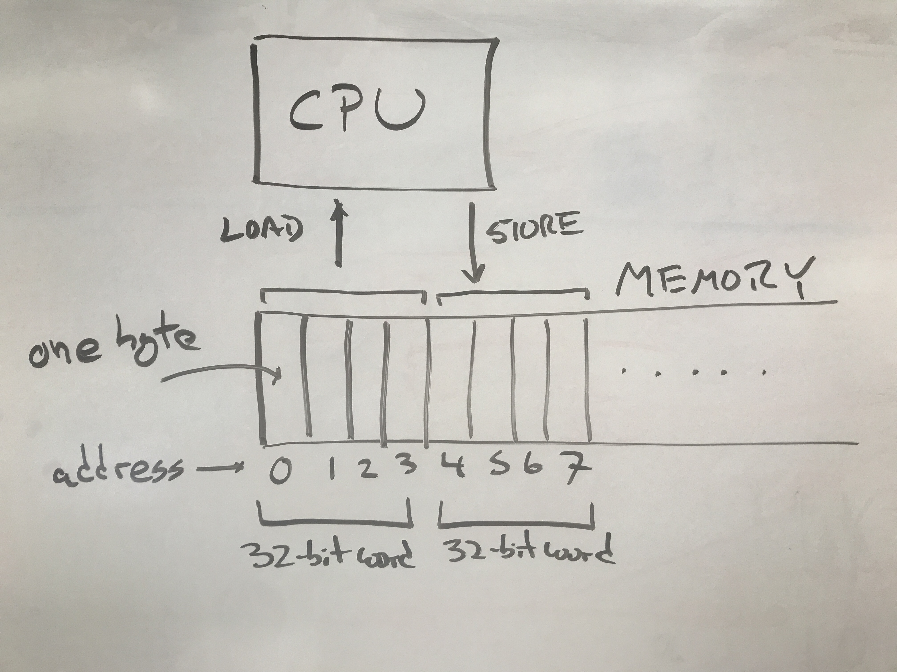
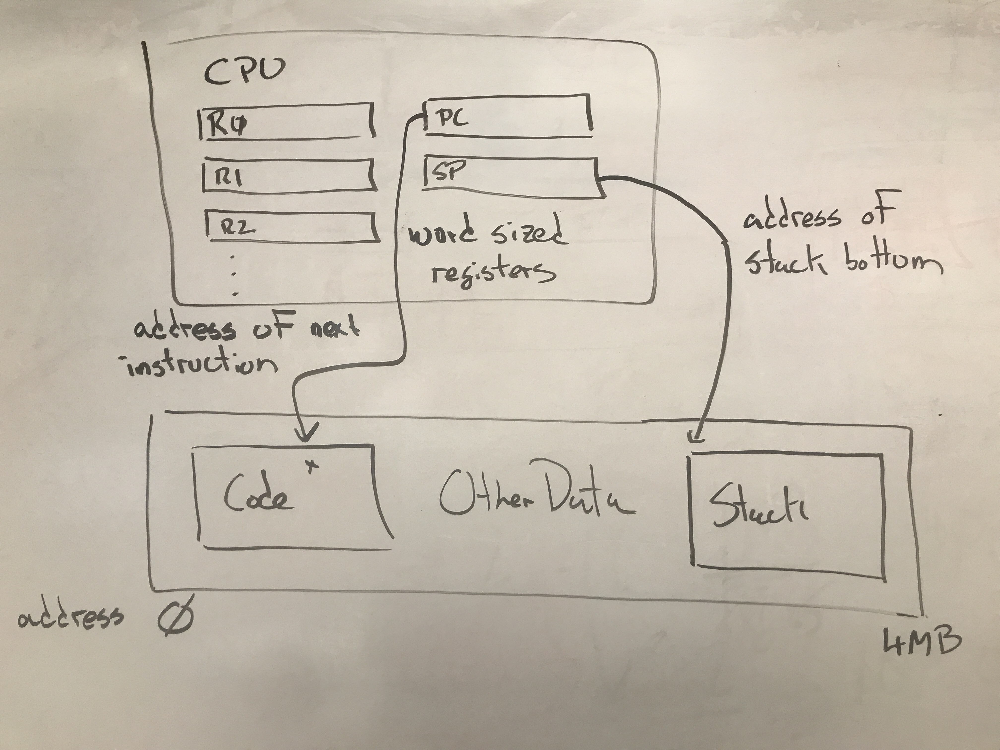
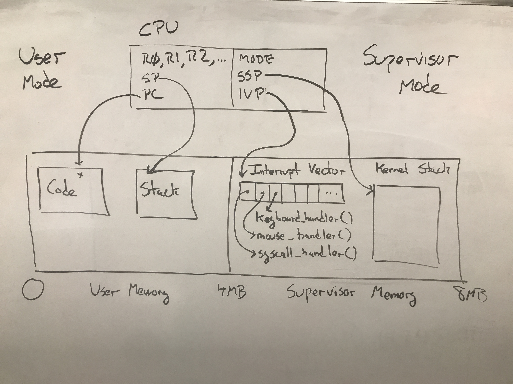
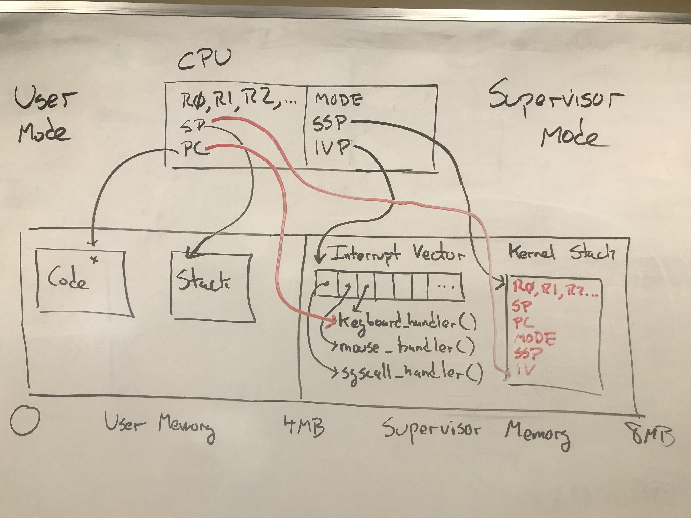

# Abstract Hardware Model

A key theme running through this semester is that an operating system requires
a partnership between hardware and software. In many different ways, the OS
relies upon the hardware to provide a *basic capability* that is made complete
by the software in the operating system kernel.

So, in order to understand an operating system, you must first have a good mental
model of how a computer system works at the machine language level.  Since our
textbook doesn't have a lot to say about hardware (and not everyone has taken Computer Architecture yet),
this article will provide some baseline information about the hardware capabilities
of an "abstract" computer.

All the concepts shown here are present in any kind of CPU, although they tend to
have slightly different names and arrangement of details.

## System Block Diagram

At its core, a computer system consists of a CPU that executes a program,
and a memory space that contains the program instructions and data.
The CPU can perform a `LOAD` on an address that returns a specific value,
or a `STORE` that sets a memory location to a specific value.



While most computer systems can address each individual byte within a memory
space, it is more efficient to access a complete *word* consisting
of several bytes together.  For example a "32-bit machine" has registers that
are 32 bits (4 bytes) wide, and will prefer to load and store 4 bytes all at once.
So, a `LOAD` from address 0 would give back address 0-3, a `LOAD` from address 4
would give back addresses 4-7, and so on.  Typical word sizes have changed over
time: early microcomputers had word sizes of 8 or 16 bits, and most full-featured
CPUs today have 64-bit words.

## User Mode Registers and Instructions

The CPU contains a number of registers that describe
the state of a running program.  A typical set of registers
looks like this:

|----------------|-------------------|--------------|
| Mnemonic       | Name              | Purpose      |
|----------------|-------------------|--------------|
|R0, R1, R2, ... | General Registers | Used to perform arithmetic, address computations, and control flow of program.
|SP              | Stack Pointer     | Points to the memory address of the next place to push/pop itesm on the stack.
|PC              | Program Counter   | Points to the memory address of the next instruction to load.
|---------|--------------------------|--------------|

The basic operation of the CPU is to read one instruction from memory (at the location given by the PC),
carry out that instruction, then increment the PC, and repeat.  Each instruction performs one simple
operation on the CPU registers or memory.  A program is built up from a large number of instructions.



For example, this `ADD` instruction adds together the contents of registers `R0` and `R1` and places the result in `R2`:

```
ADD  R0, R1, R2
```

Likewise, there are similar instructions all basic math and logical operations.
A *literal value* consisting of a small integer can be used instead of one of the
registers, if desired.  For example:

```
SUB  R3, R4, R5   # subtract R3 from R4
MUL  R2, $5, R0   # multiply R2 by 5
AND  R6, R5, R2   # logical-and of R6 and R5
```

To access memory, explicit `LOAD` and `STORE` instructions move one word
between specific memory locations and a register:

```
LOAD  $1000, R2  # load contents of address 1000 into R2
STORE R3, $1004  # store contents of R3 into address 1004
```

It is convenient for many purposes to designate part of the memory
as "the stack", an area for stashing recently-used values, and then retrieving
them later.  For historical reasons, the stack usually starts at high values,
and grows "down" toward lower values.

The `SP` (Stack Pointer) register holds the address of the next location
to be used on the stack. A `PUSH` instruction to store a value to the location given by `SP`, and then
decrement the `SP`.  Conversely, the `POP` instruction will load a value from the location given by
`SP`, and then increment `SP`.

For example, the stack can be used like this to save the values of registers R1, R2, and R3:

```
PUSH R1
PUSH R2
PUSH R3
```

The program can then proceed to use those registers for other computations.
When it wishes to recover the saved values, it can simply `POP` the values
off the stack in the reverse order:

```
POP  R3
POP  R2
POP  R1
```

The `JMP` instruction causes the program to "jump" to another memory
location, and works simply by setting the `PC` to the indicated value:

```
JMP  $3000
```

In order to call a function like `printf`, it is not enough to jump to the
function, but also provide a way to come back when done.  The `CALL` instruction
takes the address of a function like this:

```
CALL printf
```

And the effect of the instruction is to push the next value of the
`PC` on the stack and `JUMP` to the address of the `printf` function.
When the function is complete, all it has to do is `POP` the `PC` off
of the stack, and it will return to the place where it was called.
The `RET` instruction does exactly this:

```
RET
```

And is really just a synonym for this:

```
POP PC
```

The registers and instructions given so far comprise the essential user-mode
operations of any computer. Any "ordinary" program will combine these instructions
and registers to carry out standard programming tasks.  Keep in mind that the names
I have given here are the "generic" concepts, and the exact names and details differ
across specific processor models.  (For example, Intel processors use the term Instruction Pointer (IP)
instead of Program Counter (PC), but the concept is the same.)

# Supervisor Mode Registers and Instructions

In order to make an operating system possible, a CPU must be able to distinguish between
running a regular program and running an operating system.  These two modes are known as
*User Mode* and *Supervisor Mode*.

User Mode is the "normal" mode in which the CPU is busy running a user's program most of the time.
In this mode, the CPU's access to the hardware is limited, so as to prevent one program
from interfering with another.  A program running in User Mode can only access the normal
registers, and is prevented from accessing the registers and memory that belong to the supervisor.

Supervisor Mode is the mode for running the operating system (or virtual machine, hypervisor, etc)
that supervises all other programs running.  In Supervisor Mode, the CPU has access to all aspects
of the hardware, and can take any action without limit.
The CPU has several additional registers available in Supervisor Mode.  These are typically called:

|---------|--------------------------|--------------|
|Mnemonic | Name                     | Purpose      |
|---------|--------------------------|--------------|
|MODE     | Mode Register            | Indicates whether CPU is in User or Supervisor mode. |
|SSP      | Supervisor Stack Pointer | Stack pointer used to handle interrupts in supervisor mode. |
|IVP      | Interrupt Vector Pointer | Pointer to interrupt vector table containing interrupt handlers. |
|---------|--------------------------|--------------|

While running a program in User Mode, these registers are essentially "invisible".
They have values, but there is no way for the user program to access them.
If the program should attempt to access these values,
the CPU will prevent the access and raise a "Privileged Instruction" interrupt.

## Interrupts

An interrupt can be thought of as an "involuntary function call".  It is a signal
delivered to the CPU that causes it to take a specific action on receipt.

We can distinguish three different kinds of interrupts, based on the triggering event.

- An *interrupt* is caused by an external I/O device that requires attention.
- An *exception* is caused by software doing something unexpected like a divide by zero.
- A *trap* is caused by the program deliberately invoking the `TRAP` instruction.

But regardless of the source of an interrupt, the resulting action is the same.
The CPU hardware itself takes a very specific set of actions whenever an interrupt occurs.
Informally, it stops the currently running program, and transfers control to a predefined
program (the operating system!) that will handle the interrupt in supervisor mode,
and then eventually return control to the original program.

More formally, here is what happens when an interrupt is received:

1. Push all registers (both user and supervisor) to the SSP.
2. Switch `MODE` from User to Supervisor.
3. Set `SP = SSP`.
4. Set `PC = IVP[n]`, where n is the specific interrupt number.

The number `n` is provided by the hardware and indicates exactly what the source
of the interrupt is.  For example, here is the [table of interrupt numbers](https://wiki.osdev.org/Interrupt_Vector_Table) for Intel X86 CPUs.

The `IVP` is a single register that points to the location of the Interrupt Vector (IV)
which is stored in supervisor memory.  The IV itself is just an array of pointers to
functions that should be run whenever a specific interrupt happens.  (These are sometimes called
Interrupt Service Routines (ISRs).)

When an operating system starts, one of the first things it does it to set up the Interrupt Vector
to contain pointers to particular functions that will handle the events of interest automatically.
An OS would typically have a variety of functions like this:
- `keyboard_handler()`
- `disk_handler()`
- `mouse_handler()`
- `timer_handler()`
- `syscall_handler()`

With the Interrupt Vector set up properly, each of these functions will now get called
automatically whenever an interrupt indicates an event of interest.
When the user's program is running in User Mode, the system looks like this:



And then when an interrupt occurs (let's say, the keyboard interrupt),
the CPU will take the actions given above, which results in the user's
registers saved on the kernel stack, and the CPU running the `keyboard_handler`
function in the operating system:



Keep in mind that the hardware **automatically saves** the state of the
currently-running computation by virtue of saving all of the registers on the stack.
When the work of the interrupt handler function is complete, then the OS must restore
the state of the previously running program so that it can continue its work.

This is accomplished by using the `RTI` (Return From Interrupt) instruction as the
final instruction of the handler function.  The action of `RTI` is simple and elegant:
all it does is `POP` **all** of the registers off the stack.  That's all!  This has the
effect of restoring **everything** to the way it was before the interrupt occurred:
the general purpose registers, `PC`, `SP`, `MODE`, `SSP`, everything.  From the perspective
of the running program, nothing happened, and it simply continues its work.

## System Calls

As it turns out, an interrupt is the **only** way for the operating system to gain
control of the machine.  In the case of external hardware interrupts, these happen
at unpredictable times in response to the user pressing keys, moving the mouse,
receiving network packets, etc.  But what if the running program wants to make a
deliberate request of the operating system?

To perform a system call, the running program will set R0 to indicate *which* system
call is desired, put arguments to the system call in the remaining registers, and and then use the `TRAP` instruction to force an interrupt.  In doing so, the interrupt mechanism will save the state
of the program and jump to the appropriate entry in the Interrupt Vector.
The operating system will have set up this entry to point to a function
`syscall_handler` which examines the request, and takes appropriate action on the user's
program.

There are system calls to do all sorts of things: manipulate files,
control processes, communicate over the network, and more.
We will explore these in the coming weeks.

## Bonus Info: Basekernel Details

**(This is not required information, but may be of interest if you want to explore more.)**

[Basekernel](https://github.com/dthain/basekernel) is a small operating system
kernel by Prof. Thain for demonstrating the principles of operating systems.  You can build and try it out yourself in a virtual machine on your laptop, if you like.

Here is where you can find these principles illustrated in Basekernel:

- [library/syscalls.c](https://github.com/dthain/basekernel/blob/master/library/syscalls.c) contains the user-mode functions for each system call.  Each one gathers arguments and passes it to the generic function `syscall`.
- [library/syscall.S](https://github.com/dthain/basekernel/blob/master/library/syscall.S) contains the assembly-language source for `syscall` which puts arguments into registers, and then forces a trap with the `int 0x80` instruction.
- [kernel/kernelcore.S](https://github.com/dthain/basekernel/blob/master/kernel/kernelcore.S#L466) which points to handlers named `intr00-intr48` that
eventually call C functions `interrupt_handler` and `syscall_handler`.
- [kernel/syscall_handler.c](https://github.com/dthain/basekernel/blob/master/kernel/syscall_handler.c#L554) contains the C function `syscall_handler` which examins the provided arguments, and then calls functions like `sys_process_fork` and `sys_open_file` as appropriate to carry out the request.
