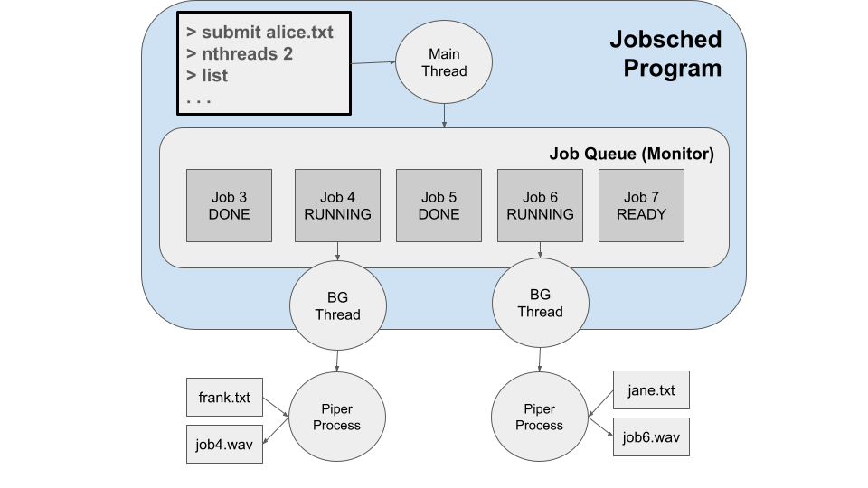

# Project 4 - Job Scheduler

The goals of this project are:
- To demonstrate mastery of process and thread management.
- To practice working with synchronized data structures.
- To gain experience with asynchronous job scheduling.

## Overview

Consider what happens when you have a large amount of work to
accomplish, but you cannot simply run them everything at once:
downloading  lots of large files, sending models to a 3D printer,
rendering lots of frames for a movie, processing credit card payments, etc.
To manage a large amount of work, you need a **job scheduler** which will
accept submissions, arrange for them to execute, and report back information
to ther user.  In this project, you will build a job schedule for text-to-speech conversion.

## Text to Speech System

For this project, we will be making use of an existing text to speech
system known as [Piper](https://github.com/rhasspy/piper).
Briefly, Piper reads in a plain text file and generates output in
the form of a WAV file containing a voice reading the text.
(It does a variety of other things too.)

You will need to do some setup to get piper working in your home directory.
It will be easiest to put it inside of the working directory for your project,
like this:

```
cd $HOME
mkdir opsys-project4
cd opsys-project4
curl -L https://github.com/rhasspy/piper/releases/download/v1.2.0/piper_amd64.tar.gz > piper.tar.gz
tar xvzf piper.tar.gz
```

Then, you will need to install a voice from the [voice library](https://huggingface.co/rhasspy/piper-voices/tree/v1.0.0).
These instructions install the `arctic` voice, but you can pick another
one if you like.

```
curl -L https://huggingface.co/rhasspy/piper-voices/resolve/v1.0.0/en/en_US/arctic/medium/en_US-arctic-medium.onnx > arctic.onnx
curl -L https://huggingface.co/rhasspy/piper-voices/resolve/v1.0.0/en/en_US/arctic/medium/en_US-arctic-medium.onnx.json > arctic.onnx.json
```

Now, in order to have some text to convert, go to [Project Gutenberg](https://www.gutenberg.org/browse/scores/top)
and copy-paste a paragraph from 5-10 different books, each one into a different file.  For example, suppose
you have a file called `alice.txt` containing:

```
Alice was beginning to get very tired of sitting by her sister on the
bank, and of having nothing to do: once or twice she had peeped into
the book her sister was reading, but it had no pictures or
conversations in it, “and what is the use of a book,” thought Alice
“without pictures or conversations?”
```

Use Piper to convert this into a WAV file reading it out load:
```
piper/piper -f alice.wav -m arctic.onnx < alice.txt
```

Download that file and play it back.  Neat, eh?

If that's working, you can delete the downloaded tarball:
```
rm piper.tar.gz
```

Now, two things you should notice about running Piper are
(a) it takes a non-trivial amount of time to generate the output, and
(b) the output is much larger than the input text.
If you were running a service for performing text-to-speech conversion,
it would not be a good idea to simply run every request simultaneously.
Instead, it would be better to establish a queue of jobs to execute,
and then carry them out in an orderly manner.

## The Job Scheduler

In this project, you will build a program called **jobsched** for managing
a large number of text to speech jobs.  The basic idea is that the
user of the system will *submit* requests to convert text to speech.
**jobsched** will accept those requests, organize them into a job queue,
and then carry them out as resources are available.  If there are a very
large number of requests to execute, then only a few will be executed
at a time, if there is sufficient storage space available.

When started, your program should simply wait for input from the user.
It should accept commands like this:

```
submit <file>
nthreads <n>
list
wait <jobid>
waitall
delete <jobid>
schedule <fifo|sjf|balanced>
quit
help
```

The `submit` command defines a new text-to-speech job, and names the
input text file to convert.
`submit` should **not** perform the conversion itself!  Instead, `submit` should add the job to the queue,
and display a unique integer job ID generated internally by your program.
(Just start at one and count up.)  The job will then run in the background
when selected by the scheduler.   When done, it should produce an output file
called `jobN.wav`, regardless of the name of the input file.
So, Job 1 will produce `job1.wav`, Job 2 will produce `job2.wav`, etc.

The `nthreads` command should start `n` background threads that perform
text-to-speech tasks on the submitted jobs.  The `nthreads` command may only be given once in
any session.  If it is given a second time, it should fail.

The `list` command lists all of the jobs currently known,
giving the job id, current state (WAITING, RUNNING, or DONE), input filename,
size of the input file, and size of the output file (if DONE).
It should also display the total size of all input files,
the total size of all output files (for DONE jobs),
the average turnaround time (of DONE jobs), and average response time (of DONE jobs.)
You can format this output in any way that is consistent and easy to read.

The `wait` command takes a jobid and pauses until that job is
done running.  Once complete, it should display the final status
of the job (success or failure) and the time at which it was submitted,
started running, and completed.  (If the job was already complete,
then it should just display the relevant information immediately.)

The `waitall` command should block until all jobs in the queue
are in the DONE state.

The `delete` command takes a jobid and then removes the job
from the queue, along with its output file.  However, a job
cannot be deleted while it is in the RUNNING state.
In this case, display a suitable error and
refuse to delete the job.

The `schedule` command should select the scheduling algorithms
used:  `fcfs` is first-come-first-served,
and `sjf` is shortest-job-first, and `balanced` should prefer
the shortest job, but make some accomodation to ensure that
no job is starved indefinitely.

The `quit` command should immediately exit the program,
regardless of any jobs in the queue.  (If end-of-file is detected
on the input, the program should quit in the same way.)

The `help` command should display the available commands
in a helpful manner.

## Storage Constraints

A particular challenge with the text-to-speech conversion is that
the output files can be quite large.  If the user submits 100 (small)
text files, the resulting sounds files may overflow the disk!
To prevent this from happening, the background threads should decline
to start new jobs whenever the total size of output files (`job1.wav`, `job2.wav`, etc)
of DONE jobs exceeds a total of 100MB.

Note that the `delete` command removes a job as well as its output file.
So, if the system has reached the 100MB limit, the user can `delete` a
few jobs to free up space, and the background threads should automatically resume work.

## Implementation Advice

This project will bring together a variety of concepts that you have
studied so far: process management, thread synchronization,
and scheduling.  We aren't going to talk through every little function
you should use; you will need to review prior material and look up
documentation as needed.

Here is the basic architecture you should use:



The program should consists of several threads: one main thread and several
background threads, which interact through a common job queue.
The main thread interacts with the user by reading commands, submitting jobs to 
the queue, displaying status, and so forth.  One or more background threads
will carry out the actual text-to-speech tasks.
Each background thread should select the next job to run (based on the current scheduling
algorithm), run text-to-speech as a separate external process, and then update the job queue when that process is complete.

The tricky part of this assignment is the job queue itself.
The job queue should be implemented as a `monitor` as discussed
in class: a data structure that is protected by a `mutex`
and a `condition variable`.  The job queue should
only be accessed by functions that take care to use the mutex
for mutual exclusion and the condition variable to sleep and wakeup.

Generally speaking, the main thread should remain responsive to
the user by only performing quick actions on the job queue.
The user ought to be able to see immediate response to all commands,
except those that specifically wait for a job to complete.

## Testing

Test your scheduler carefully by using it to run a variety of jobs,
both short and long, in different orders.  Try different combinations
of operations: submitting, waiting, removing, etc.  Try the different
scheduling algorithms, and verify that the statistics reported are correct
for the jobs that actually run.  Try running with different numbers
of background threads, and check that all are kept appropriately busy.

Think critically about unexpected
events, such as improper input from the user, incorrect arguments to
commands, and so forth.  Whenever such an unexpected event occurs,
you should display a detailed and helpful error message, and
(where possible) continue operation of the program.

A particularly useful way to test is to create small input files
that contain a sequence of operations, for example create `test1.txt`
containing this:

```
submit frank.txt
list
nthreads 3
wait 1
list
delete 1
list
quit
```

Then, just run your scheduler with input redirected from that file:
```
./jobsched < test1.txt
```

## Turning In

Please review the [general instructions](../general) for assignments.

Turn in the following:

- All of the source code files for `jobsched`.
- A Makefile that builds `jobsched` when the user types `make`, and cleans up all executables and object files on `make clean`.

**Do not turn in Piper or voice files or output wave files, since these are large and we don't need the extra copies.**

This assignment is due at **11:59PM on Wednesday, March 27th**
To submit your files, just copy them into the `project4` subdirectory of your dropbox.

## Grading

Your grade will be based on:
- Correct implementation of each of the interactive commands.
- Correct behavior of the background threads.
- Correct synchronization techniques in the job queue.
- Good coding style, including clear formatting, sensible variable names, and useful comments.
