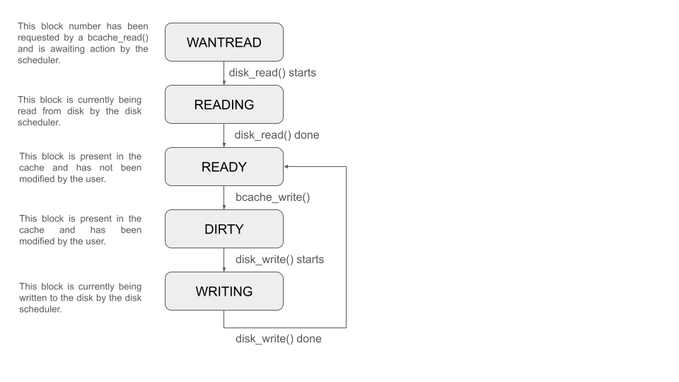
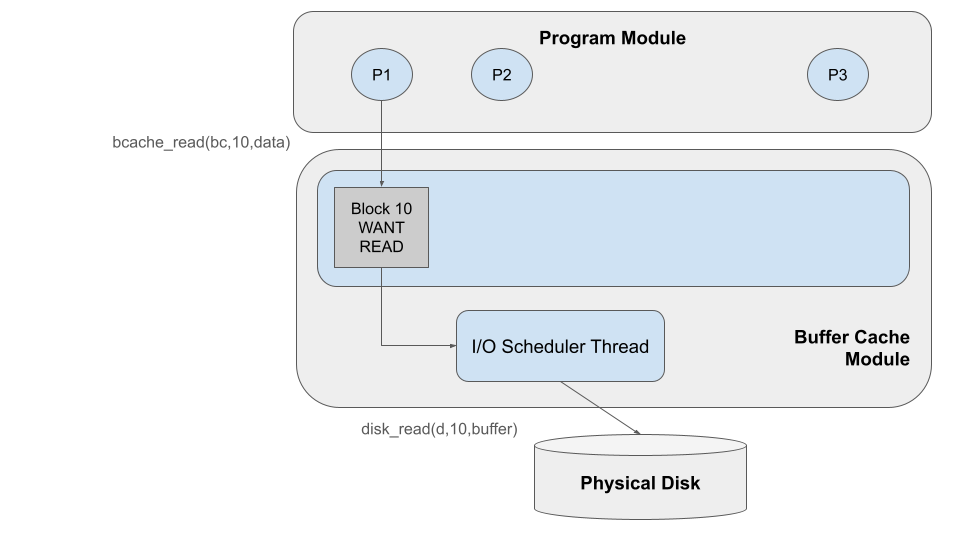
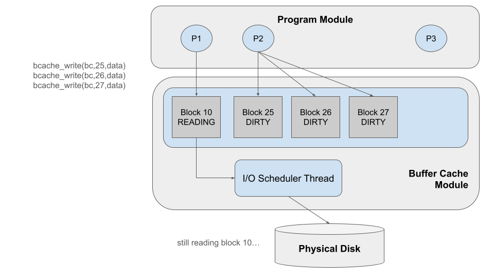
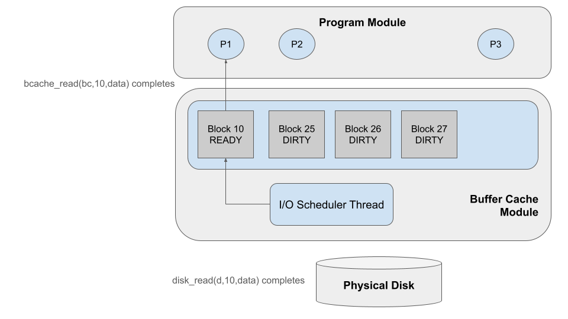
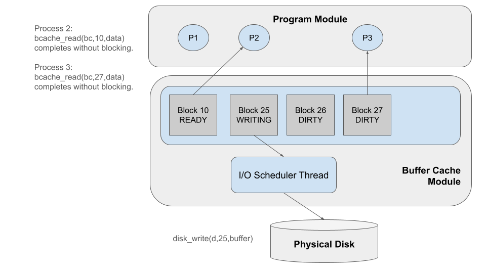
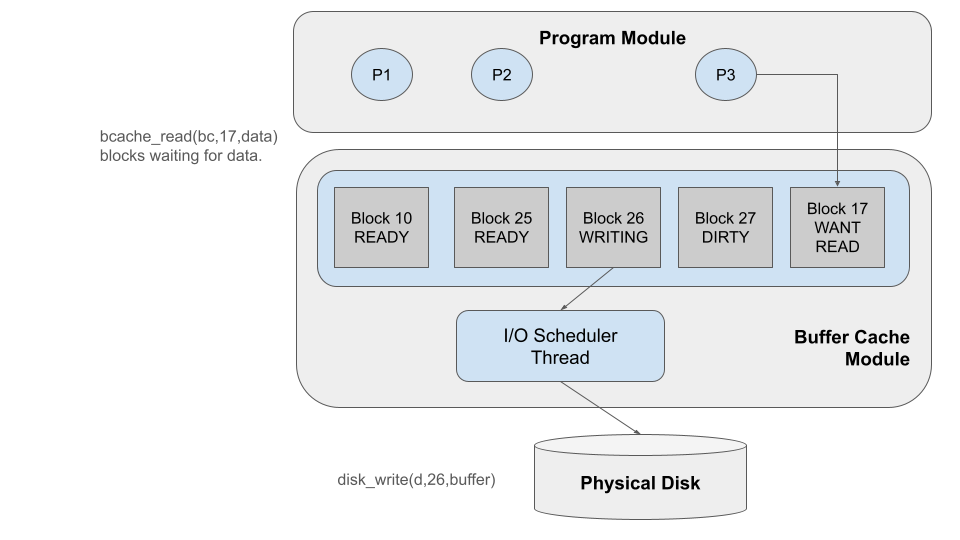

# Project 6: Buffer / Cache

## Objectives

In this project, you will build a buffer/cache, which is the central
data structure used to manage I/O performance in an operating system.
In this project you will apply many of the techniques and skills
that you have learned over the course of the semester.
You will:

- implement synchronized access to data structures from multiple threads.
- avoid deadlock between competing threads.
- improve the performance of the I/O system by managing memory effectively.
- schedule multiple pending operations in an efficient manner.
- develop even more expertise in C programming by using structures and pointers extensively.

**This project may be done in pairs or singletons.**
Please submit your work to a single dropbox with a PARTNERS file
that indicates the project members.  Both partners will receive the same grade.

**This is a challenging project that will take time to get right.**
Although the total quantity of code is not large (perhaps a few hundred lines)
you will need to think carefully about data structures, thread synchronization,
scheduling, and other issues.  This will require extended time to think, troubleshoot,
and think some more over the next few weeks. **Get started right away!**

## Overview

In this project, you will build a buffer/cache for an operating system.
This will be a challenging but fun project which will help to reveal
the inner workings of the OS, and shows the importance of managing
memory as part of I/O performance.  We will provide you with several programs
that make disk requests, a simulated disk that satisfies those
requests, and your job is to build the buffer/cache module that
sits in the middle.    This figure gives the overall idea:


At the top are a large number of programs running concurrently
and accessing the disk in different patterns:some sequentially,
some random, and some in concentrated areas.  These programs
will make their requests known by calling the functions
`bcache_read()` and `bcache_write()`.  (They also check what
they are reading to make sure it is correctly read back.)
When all the programs are
done, the main program will call `bcache_sync()` to finish up.

In the middle is the buffer/cache, the part that you will create.
This module implements the functions `bcache_read`, `bcache_write`,
and `bcache_sync` which both operate by manipulating the actual buffer data structure.
It consists of a number of 4KB blocks of memory, each representing
one block of data, in one of several states.  The buffer/cache has
two combined jobs:

1 - It **buffers** blocks when they are written, so that the writing
process may return quickly, and the data may be written to disk as time permits.

2 - It **caches** recently accessed data in memory, so that processes
that return to the same data may access it at memory speed, instead of waiting for the dis.

Note that `bcache_read` and `bcache_write` should operate only on the
buffer data structure, they do not access the actual underlying disk.
That is the job of the **I/O scheduler thread** which runs in the background.
It considers the current state of the data structure, and performs
the actual `disk_read` and `disk_write` operations according to one of
several scheduling policies, updating the buffer structure as needed.

Finally at the bottom is the simulated disk, which is very similar
to the one you used in the virtual memory project.  It has the (simple)
capabilities of a real disk, allowing you only to read and write one
whole block at a time.  Only one thread (the I/O scheduler) can access
the disk at a time, and this is the performance bottleneck of the system.
Each request to the disk will take at least 10ms, plus some extra time
for the distance that the disk must travel since the last request.

## Buffer / Cache Implementation

As in previous projects, the buffer/cache is at heart a **data structure**
protected by a **monitor** (mutex and condition variables).
Each block stored in the cache will consist of 4KB of the actual data,
along with some additional values to indicate *which* block number it
corresponds to on the disk, and the current state of the block.

Programs will access the buffer/cache using the following three operations:
```
int bcache_read( struct bcache *bc, int blocknum, char *data );
int bcache_write( struct bcache *bc, int blocknum, const char *data );
int bcache_sync struct bcache *bc );
```

As the name suggests, `bcache_read` should read a 4KB block from disk
into the buffer/cache, then copy the 4KB cached data into the `data` pointer
provided by the caller.  `bcache_write` should copy 4KB from the `data` pointer
into the buffer/cache, and arrange for it to be written back to disk as time
permits.  `bcache_sync` should pause until all pending writes in the buffer
have completed.
These three functions do not access the disk directly, but may modify
the state of the buffer cache, and may wait for the I/O scheduler
thread to take some action before returning.

The I/O scheduler thread running in the background does not interact
with the caller directly, but should examine the state of the buffer
cache, decide what action needs to be taken on a particular block,
and then perform `disk_read` or `disk_write` as needed to carry
out the action.

You will need to record the current state of each block in the cache,
and we suggest that you use the following state machine:



`WANTREAD`
indicates a block that has been requested by `bcache_read` and is not
yet fulfilled. `READING` indicates a block that is currently being
read in by the I/O scheduler thread.  `READY` indicates a block that
has been read into the buffer/cache and is ready to be used immediately.
`DIRTY` indicates a block that has been modified by `bcache_write`.
`WRITING` indicates a block that is currently being written to disk
by the I/O scheduler thread.  Once a block has been written, it is now
clean and goes back to the `READY` state.

## Example Operation

Here is an example of a few operations on the buffer/cache to give the idea.
Suppose that we start with a completely empty buffer.
Process P1 acts first, issuing a `bcache_read` on block 10.
Because that block is not (yet) in the cache, the buffer cache reacts
by creating a new block in memory in the `WANTREAD` state.  `bcache_read` then
waits for the I/O scheduler thread to take action.  The scheduler thread
notices the waiting block, and takes action by changing it to the `READING`
state, and issues the `disk_read` operation, which may take some time.



While the I/O scheduler thread is busy reading (and P1 is waiting),
P2 goes about its business and issues a `bcache_write` operation on block 25.
The buffer cache accepts this new block, and makes a copy of it in the buffer cache.
It begins in the `DIRTY` state, because it reflects data that has not yet
been written to disk.  `bcache_write` can return immediately, trusting that
the I/O scheduler thread will (eventually) write the block to disk.
P2 then repeats this action on blocks 26 and 27.



Finally, the I/O scheduler completes the `disk_write` operation, and marks
block 10 as `READY`.  It notifies the waiting thread that the block is now
ready, and the corresponding `bcache_read` operation completes, so that P1
can go about its further business.



Next, the I/O scheduler looks for more work to do.  It notices that Block 25
is dirty, so it changes its state to `WRITING` and calls `disk_write` to copy
it back to the disk.  In the meantime, P2 calls `bcache_read` on block 10.
Block 10 is already in the buffer/cache, and so it can be provided to P2 immediately
without waiting for the I/O scheduler thread.  In a similar way, P3 calls `bcache_read`
to read block 27, which is also present and can be provided immediately.



Eventually, the I/O scheduler thread completes working on Block 25,
and marks it as `READY`, because it is no longer dirty.  The scheduler thread
looks for more work to do, and selects block 26.  It changes the state to
`WRITING` and calls `disk_write` as appropriate.  Meanwhile, P3 calls `bcache_read`
to read block 17, which is not in the cache, and so it blocks in the `WANTREAD` state.



## Things to Figure Out

This project will require that you work out several important details
in order to get a correct result.  We won't tell you exactly how to go
about it (since there are multiple good solutions) but these are some
areas that you will need to ponder.

**Data Structures** - You can organize the data structure of the buffer
cache however you like, as long as it stores the necessary data efficiently.
You will probably have a structure representing a single block that looks
like this, but you are welcome to add or modify fields as required:
```
struct block {
    int blocknum;
    int state;
    char data[4096];
};
```

**Thread Synchronization** - The programs and the I/O scheduler will
run as concurrent threads, all attempting to modify the buffer/cache
data structure simultaneously.  Use what you have learned about threads
and synchronization to make sure that this is done safely, while still
permitting independent actions to proceed concurrently.

**Replacement Policy** - The buffer/cache has a maximum number of blocks
it can hold.  When the cache becomes full, you must select some block to
remove, so that you can allocate space for a new one.  Be sure to do so
safely, so that you don't yank away a block in the middle of an access.

**Scheduling Policy** - The I/O scheduler thread will continually select
a new block to act on after completing its current action.  Which is the
best block to select?  Keep in mind that the disk will operate more quickly
if it doesn't have to travel as far between operations.

**Corner Cases** - Each `bcache_read` or `bcache_write` may encounter
a block in any one of the states given above.  Take the time to consider
every single state and think through what should happen when a `bcache_read`
or `bcache_write` encounters a block in that state.

## Getting Started

Download the [source code](http://github.com/dthain/opsys-sp24/tree/main/project6/src) and build it with `make`.

The system is invoked as follows:

```
./bcache <nthreads> <buffer-blocks> <disk-blocks>
```

For example, to run with 5 threads, 10 buffer blocks in memory, and 100 disk blocks:

```
./bcache 5 10 100
```

As provided, the system will actually run correctly, although slowly.
We have provided you with a "dummy" implementation of the buffer cache,
in which `bcache_read` and `bcache_write` are implemented by calling
`disk_read` and `disk_write` directly.  The result is that each program
will perform I/O in a blocking manner and run **very** slowly.
By implementing the buffer cache correctly, you will get this system
to run **much** faster.

At the end of the run, the main program will print out some key
performance metrics, simply counting the number of buffer and
disk operations over the elapsed time, like this:

```
 elapsed time: 9.93s
bcache  reads: 700
bcache writes: 300
bcache   perf: 100.75 ops/s
  disk  reads: 501
  disk writes: 252
  disk   perf: 75.86 ops/s
```

Note that the disk will always be less than 100 ops/s,
because each operation takes (at least) 10ms.
But, by making effective use of the buffer cache,
you should be able to get the buffer performance **much** higher
than 100 ops/s.
And, by scheduling the I/O thread carefully, you should
be able to get the disk performance very close to 100 ops/s.

How fast can you make it go?

## Troubleshooting Tips

We suggest that you test your implementation in a variety of
configurations of increasing complexity and difficulty, such as:

```
./bcache 1 100 100   # single thread, memory = disk
./bcache 1 20 100    # single thread, memory < disk
./bcache 10 100 100  # many threads, memory = disk
./bcache 10 20 100   # many threads, memory < disk
./bcache 20 5 100    # many threads, memory < threads
```

Don't be surprised if some of these don't work the first time.
If your buffer cache returns an incorrect block back to a program,
then you will get a message like this:
```
CRASH: bcache_read of block %d returned incorrect data from block %d instead!
```

We recommend that you troubleshoot by adding `printfs` to indicate
what each thread is doing within `bcache_read` and `bcache_write`,
and what the I/O scheduler thread is doing.  By tracing through
the set of steps that lead to a crash, you should gain insight
into the nature of the problem.

## Turning In

Please review the [general instructions](../general) for assignments.

This projects is due at **11:59PM on Wednesday April, 30th**.  Late assignments are not accepted.  (And it's also the end of the semester!)

You should turn the following to **one** of the partner's dropboxes:
- All of your source code.
- A `Makefile` that builds the code.
- A `PARTNERS` file indicating the names of both partners.
- A `RESULTS` file containing the plain text output of the following commands:
```
./bcache 1 100 100   # single thread, memory = disk
./bcache 1 20 100    # single thread, memory < disk
./bcache 10 100 100  # many threads, memory = disk
./bcache 10 20 100   # many threads, memory < disk
./bcache 20 5 100    # many threads, very limited memory
```
As a reminder, your dropbox directory is:

```
/escnfs/courses/sp24-cse-30341.01/dropbox/YOURNAME/project6
```

## Grading

Your grade on this assignment will be based on the following:

- Correct execution with a single program (and one background thread). (50%)
- Correct execution with many programs. (30%)
- Correct execution with many programs and limited memory. (10%)
- Good coding style, including clear formatting, sensible variable names, and useful comments. (10%)

